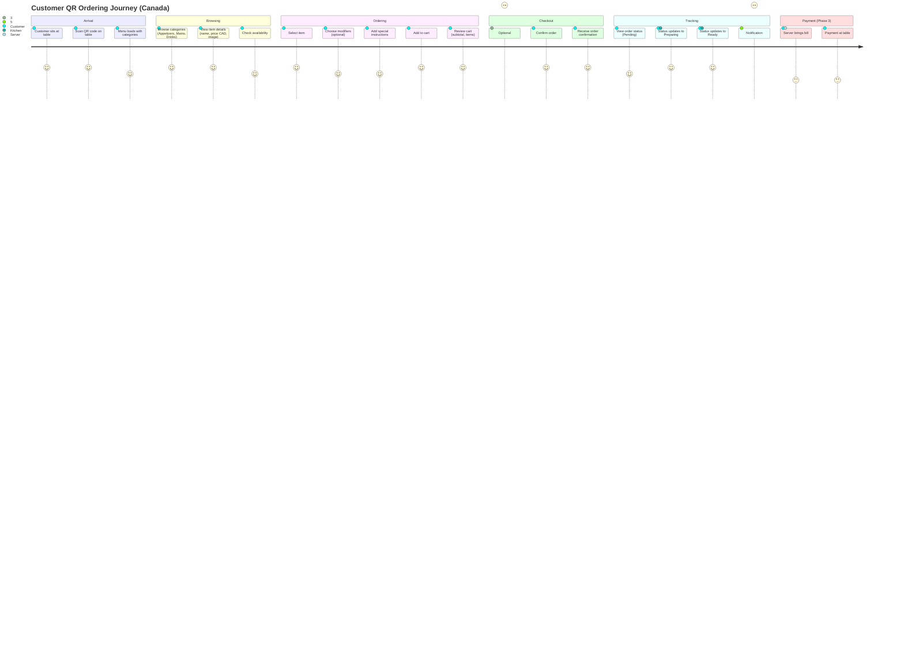
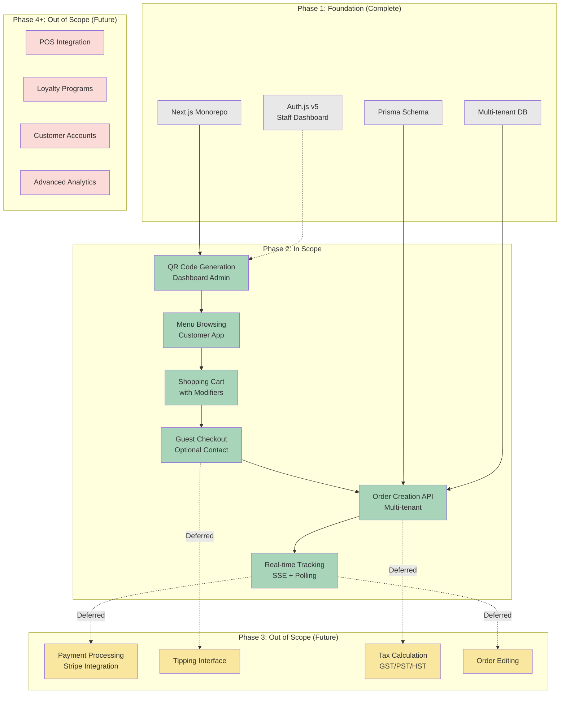

# PRD: Customer QR Ordering System - Phase 2

## Overview

### One-line Summary
Enable contactless, self-service QR code ordering for Canadian casual dining restaurant customers with real-time order tracking, addressing post-COVID dining preferences and operational efficiency needs.

### Background
**Market Context**: The Canadian restaurant industry ($135.2B in 2025) is experiencing a permanent shift toward digital ordering, with 78% of diners preferring QR code menus over traditional paper menus. Nearly half of Canadians (48%) are comfortable with AI and digital ordering playing a greater role in restaurants, with adoption particularly high among 18-34 year-olds (59%). QR code-enabled payments and ordering have driven 15% increases in table turnover for early adopters.

**Business Need**: Canadian casual dining restaurants with 1-10 employees (representing 74.1% of food establishments) face three critical challenges:
1. **Labor Shortage**: 45% of operators struggle to hire enough staff
2. **Efficiency Pressure**: Average spend per person rose to $63 CAD (12.5% YoY increase), making table turnover critical
3. **Customer Expectations**: 80%+ cashless transaction preference, demand for contactless ordering

**Solution**: Phase 2 builds on our multi-tenant Next.js foundation to deliver a self-service QR ordering experience that reduces front-of-house labor needs, accelerates table turnover, and meets Canadian consumer preferences for contactless dining—all optimized for small restaurant operators.

**Phase 1 Foundation Completed**:
- Next.js 15 monorepo (Customer app: port 3000, Dashboard app: port 3001)
- Prisma ORM with multi-tenant database architecture
- Auth.js v5 authentication
- SQLite (dev) / PostgreSQL (production)
- Existing models: Tenant, User, RestaurantTable, MenuCategory, MenuItem, MenuModifier, ModifierOption, Order, OrderItem, Payment

## User Stories

### Primary Users

**1. Restaurant Customer (Diner)**
- Demographics: Canadians dining at casual restaurants, all ages (focus on 18-54)
- Tech Comfort: Moderate to high (smartphone ownership ~85%+)
- Context: Seated at table, wanting quick, autonomous ordering
- Pain Points: Wait times for server attention, menu clarity, order accuracy

**2. Restaurant Owner/Manager**
- Demographics: Small business owners with 1-10 employees
- Tech Comfort: Low to moderate (need simple, reliable tools)
- Context: Managing operations, kitchen, and customer experience
- Pain Points: Labor costs, table turnover, order accuracy, operational complexity

**3. Kitchen Staff**
- Demographics: Line cooks, prep staff
- Context: Preparing orders during service
- Pain Points: Order clarity, timing, communication with front-of-house

### User Stories

**Customer (Diner) Stories**

```
As a restaurant customer in Canada
I want to scan a QR code and browse the menu on my phone
So that I can order at my own pace without waiting for a server
```

```
As a customer with dietary restrictions
I want to customize my order with modifiers (no onions, gluten-free bun)
So that my meal meets my dietary needs accurately
```

```
As a diner who values privacy
I want to place an order without providing personal information
So that I can maintain my anonymity while dining
```

```
As a customer tracking my order
I want to see real-time status updates (received, preparing, ready)
So that I know when to expect my food
```

**Restaurant Owner Stories**

```
As a small restaurant owner in Canada
I want customers to order via QR codes from their tables
So that I can reduce front-of-house staffing costs and improve table turnover
```

```
As a restaurant manager
I want all orders to automatically flow to my kitchen system
So that staff can focus on preparation instead of order-taking
```

```
As a multi-location restaurant operator
I want each location to have isolated menus and orders
So that I can manage different restaurants under one system (tenant isolation)
```

**Kitchen Staff Stories**

```
As a line cook
I want to see incoming orders with clear modifier details
So that I can prepare dishes accurately without asking clarifying questions
```

### Use Cases

**1. First-Time Diner - Quick Lunch (Primary Path)**
- Customer sits at Table 5, scans QR code on table tent
- Phone opens menu interface showing categories: Appetizers, Mains, Desserts, Drinks
- Browses "Mains," selects "Classic Burger" ($18.50 CAD)
- Adds modifiers: "No pickles," "Add bacon (+$2.00 CAD)"
- Adds to cart, continues browsing
- Adds "Caesar Salad" ($12.00 CAD) and "Domestic Beer" ($7.50 CAD)
- Reviews cart (Subtotal: $40.00 CAD), submits order
- Receives confirmation: "Order #1247 submitted - Preparing"
- Tracks status: Preparing → Ready (15 min)
- Payment handled at table by server after meal (Phase 3 scope)

**2. Family Diner - Multiple Items with Modifiers**
- Family of 4 sits at Table 12, one person scans QR
- Orders 2 kids meals (modifiers: "ketchup only," "no tomato")
- Orders 2 adult entrees with complex modifications
- Cart shows itemized breakdown with all modifiers
- Submits single order for entire table
- Kitchen receives detailed modifier list per item

**3. Guest with Dietary Restrictions**
- Customer allergic to dairy scans QR code
- Filters menu items or reads descriptions for allergen info
- Selects "Grilled Chicken Salad"
- Adds modifier: "Dressing on side," Notes: "Dairy allergy - no cheese"
- Submits order, kitchen receives allergy note prominently

**4. Network Interruption Recovery (Offline-First)**
- Customer adds items to cart while connected
- WiFi drops mid-session
- Cart persists in localStorage, continues browsing
- Attempts order submission → queued locally
- Network reconnects → order auto-submits
- Customer receives confirmation

**5. Multi-Location Operator Management**
- Operator manages "Downtown" and "Suburb" locations (different tenants)
- Downtown serves pub fare, Suburb serves family dining
- Customer at Downtown location only sees Downtown menu
- Orders isolated by tenant, no cross-contamination

## Functional Requirements

### Must Have (MVP)

#### FR-1: Menu Browsing Interface
- **FR-1.1**: Display menu organized by categories (Appetizers, Mains, Desserts, Drinks)
  - AC: Given a customer scans a QR code, when the menu loads, then all active categories with at least one available item are displayed in sortOrder ascending

- **FR-1.2**: Show item details: name, description, price (CAD), image (if available), availability status
  - AC: Given a customer views a menu item, when the item card renders, then name, description, price formatted as "$X.XX CAD", and image (or placeholder) are visible

- **FR-1.3**: Display item availability in real-time
  - AC: Given a menu item is marked unavailable by restaurant, when customer views menu, then item is grayed out with "Unavailable" badge and cannot be added to cart

- **FR-1.4**: Load menu data filtered by tenant (multi-tenant isolation)
  - AC: Given customer scans QR code for Tenant A, when menu loads, then only Tenant A's menu items are displayed (no Tenant B data visible)

#### FR-2: QR Code Generation and Table Identification
- **FR-2.1**: Generate unique QR codes for each restaurant table
  - AC: Given a restaurant admin creates a new table, when table is saved, then a unique QR code containing `{tenantSlug}/{tableId}` is generated and stored in `RestaurantTable.qrCode`

- **FR-2.2**: QR code scans resolve to customer app with table context
  - AC: Given a customer scans a table QR code, when the URL loads, then customer app opens to `/menu?tenant={slug}&table={id}` with table context preserved in URL

- **FR-2.3**: Validate table exists and is active before showing menu
  - AC: Given a customer scans QR code, when app validates table, then if table.active === false or table not found, display "Table unavailable - please contact staff" error

#### FR-3: Shopping Cart with Modifier System
- **FR-3.1**: Add menu items to cart with quantity selection
  - AC: Given a customer clicks "Add to Cart," when item is added, then cart displays item with quantity (default 1), individual price, and line total

- **FR-3.2**: Display and select item modifiers (MenuModifier → ModifierOption)
  - AC: Given an item has modifiers, when customer adds item to cart, then all modifiers are displayed with options, required modifiers enforce selection, and optional modifiers allow skipping

- **FR-3.3**: Calculate modifier pricing (+$X.XX per option)
  - AC: Given a customer selects modifier options with price > 0, when cart updates, then line item price = base price + sum of modifier option prices

- **FR-3.4**: Allow custom notes/special instructions per item
  - AC: Given a customer adds an item to cart, when "Special instructions" field is available, then customer can enter up to 200 characters (e.g., "No pickles," "Extra sauce")

- **FR-3.5**: Update cart quantities (increase, decrease, remove)
  - AC: Given a cart contains items, when customer adjusts quantity, then cart recalculates subtotal in real-time; when quantity = 0, item is removed

- **FR-3.6**: Calculate cart totals: Subtotal, Tax (deferred to Phase 3), Total
  - AC: Given a cart with items, when cart renders, then Subtotal = sum of all line totals, Tax = $0.00 (Phase 3), Total = Subtotal (Phase 2 scope)

- **FR-3.7**: Persist cart state in localStorage (offline-first)
  - AC: Given a customer adds items to cart, when browser refreshes or network drops, then cart items persist from localStorage and restore on reload

#### FR-4: Guest Checkout Flow
- **FR-4.1**: Allow order submission without mandatory customer information
  - AC: Given a customer is ready to checkout, when checkout screen loads, then customer can submit order without entering name, email, or phone (all optional)

- **FR-4.2**: Collect optional contact info (name, email, phone)
  - AC: Given a customer chooses to provide contact info, when optional fields are filled, then data is validated (email format, phone format for Canadian numbers) but not required

- **FR-4.3**: Display order summary before submission
  - AC: Given a customer reviews checkout, when summary renders, then all items, modifiers, quantities, prices, and total are displayed with "Confirm Order" CTA

- **FR-4.4**: Submit order as "PENDING" payment status (payment deferred to Phase 3)
  - AC: Given a customer confirms order, when order is created, then Order.status = "PENDING", payment status = "payment pending", and order appears in kitchen/tracking system

#### FR-5: Order Creation API
- **FR-5.1**: Create Order with OrderItems via API endpoint
  - AC: Given a customer submits cart, when POST /api/orders is called, then Order record is created with status="PENDING", OrderItem records created for each cart item with modifiers serialized (or normalized if schema supports), and tenantId isolation enforced

- **FR-5.2**: Validate order data (items exist, table exists, tenant isolation)
  - AC: Given order creation API receives request, when validation runs, then return 400 error if any item ID is invalid, table ID is invalid, or tenant mismatch detected

- **FR-5.3**: Return order confirmation with order ID and status
  - AC: Given order is successfully created, when API responds, then return 201 status with { orderId, status: "PENDING", estimatedTime: null } (estimatedTime is Phase 3 enhancement)

- **FR-5.4**: Handle concurrent orders gracefully (e.g., menu item becomes unavailable during checkout)
  - AC: Given a menu item becomes unavailable after customer adds to cart, when order is submitted, then API returns 409 error with unavailable item details, and customer is prompted to remove item and resubmit

#### FR-6: Real-Time Order Tracking
- **FR-6.1**: Display order status: PENDING → PREPARING → READY → COMPLETED
  - AC: Given a customer submits order, when tracking screen loads, then current status is displayed with visual progress indicator (e.g., stepper: Received → Preparing → Ready)

- **FR-6.2**: Update order status in real-time using Server-Sent Events (SSE)
  - AC: Given kitchen staff updates order status in dashboard, when status changes, then customer tracking screen updates within 2 seconds via SSE without page refresh

- **FR-6.3**: Fallback to polling (30s interval) if SSE connection fails
  - AC: Given SSE connection drops or is unsupported, when fallback activates, then app polls GET /api/orders/{orderId} every 30 seconds until status = "READY" or "COMPLETED"

- **FR-6.4**: Show order items and details in tracking view
  - AC: Given a customer views order tracking, when screen renders, then order number, items (with modifiers), quantities, and total are displayed below status

- **FR-6.5**: Notify customer when order is ready (visual indicator)
  - AC: Given order status changes to "READY," when customer is on tracking screen, then prominent "Your order is ready!" message is displayed with visual/audio cue (optional sound)

### Nice to Have (Post-MVP Enhancements)

- **FR-7**: Menu search and filtering (by dietary tags, price range)
- **FR-8**: Item recommendations ("Customers also ordered...")
- **FR-9**: Order history for returning customers (requires authentication)
- **FR-10**: Estimated preparation time display
- **FR-11**: Multi-language support (English/French for Quebec)
- **FR-12**: Allergen filtering and prominent allergen warnings
- **FR-13**: Table session management (prevent multiple active orders per table)
- **FR-14**: Order modification window (5-minute grace period after submission)

### Out of Scope (Deferred to Phase 3+)

- **Payment Processing**: Credit card, Apple Pay, Google Pay (Phase 3)
- **Tipping Interface**: Tip calculation and submission (Phase 3)
- **Tax Calculation**: GST/PST/HST by province (Phase 3 - payment phase)
- **POS Integration**: Sync with existing POS systems (Future)
- **Loyalty Programs**: Points, rewards, discounts (Future)
- **Advanced Analytics**: Customer behavior tracking, menu optimization (Future)
- **Order Editing**: Modify or cancel orders after submission (Future consideration)

## Non-Functional Requirements

### Performance
- **Response Time**:
  - Menu load: < 2 seconds on 4G connection
  - Add to cart: < 100ms (client-side state update)
  - Order submission: < 3 seconds (API response)
  - Real-time status update: < 2 seconds (SSE event delivery)

- **Throughput**:
  - Support 50 concurrent customers per restaurant tenant
  - Handle 10 orders/minute per restaurant during peak hours

- **Concurrency**:
  - Cart operations are client-side (no concurrency issues)
  - Order creation API handles concurrent requests with optimistic locking on menu item availability

### Reliability
- **Availability**: 99.5% uptime during restaurant operating hours (6am-11pm local time)
- **Error Rate**: < 1% failed order submissions (excluding user errors like invalid data)
- **Offline Resilience**:
  - Cart persists through network interruptions
  - Queued orders auto-submit within 30 seconds of network recovery
- **SSE Fallback**: Automatic polling fallback if SSE connection fails

### Security
- **Multi-Tenant Isolation**: All database queries filter by `tenantId`, no cross-tenant data exposure
- **Input Validation**: Zod schemas validate all API inputs (item IDs, quantities, modifier selections)
- **PIPEDA Compliance** (Canadian Privacy Law):
  - Optional contact info collection with clear consent language
  - No data collection without customer awareness
  - Data retention limited to operational needs (order history)
- **SQL Injection Prevention**: Prisma ORM parameterized queries only
- **Rate Limiting**: 100 requests/minute per IP address on order submission endpoint

### Scalability
- **Horizontal Scaling**: Stateless Next.js API routes support load balancing
- **Database Indexing**: Index on `tenantId`, `tableId`, `orderId`, `status` for fast queries
- **CDN for Static Assets**: Menu images served via CDN (future optimization)
- **Cart State**: Client-side (localStorage) avoids server scaling bottleneck

### Accessibility
- **AODA Compliance** (Accessibility for Ontarians with Disabilities Act):
  - WCAG 2.1 Level AA compliance
  - Keyboard navigation support (tab through menu items, cart)
  - Screen reader compatibility (semantic HTML, ARIA labels)
  - Minimum contrast ratios for text and UI elements
  - Touch targets ≥ 44x44 pixels for mobile
- **Language**: English primary (French i18n infrastructure prepared for future)

### Browser/Device Compatibility
- **Mobile-First**: Optimized for iOS Safari, Chrome Android (90% of traffic expected)
- **Desktop Support**: Chrome, Firefox, Safari, Edge (latest 2 versions)
- **Screen Sizes**: Responsive design, 320px - 1920px width
- **OS**: iOS 14+, Android 10+

## Success Criteria

### Quantitative Metrics

**Primary Metrics (30-day post-launch)**
1. **Order Completion Rate**: ≥ 75% of customers who add items to cart submit an order
   - Measurement: (Orders Submitted / Carts Created) × 100
   - Baseline: N/A (new feature)
   - Target: 75%+

2. **Time-to-Order**: Average time from QR scan to order submission ≤ 5 minutes
   - Measurement: Median time between QR scan (session start) and order creation timestamp
   - Target: ≤ 5 minutes (vs. ~8-10 min with traditional server ordering)

3. **Table Turnover Increase**: 10% improvement in table turnover rate
   - Measurement: (Post-launch avg tables/hour - Pre-launch avg tables/hour) / Pre-launch × 100
   - Industry benchmark: QR ordering drives 15% turnover improvement
   - Target: 10% improvement in pilot restaurants

**Secondary Metrics**
4. **Customer Adoption Rate**: 60% of customers choose QR ordering over traditional menu
   - Measurement: (QR Orders / Total Orders) × 100 per restaurant
   - Target: 60% adoption within 60 days

5. **Order Accuracy**: ≤ 2% order errors (wrong items, missing modifiers)
   - Measurement: (Orders with Errors / Total Orders) × 100
   - Target: ≤ 2% (improvement over verbal order-taking ~5-8% error rate)

6. **System Availability**: 99.5% uptime during operating hours
   - Measurement: (Total Uptime / Total Operating Hours) × 100
   - Target: 99.5%

### Qualitative Metrics

1. **Customer Satisfaction**: Post-meal survey (optional)
   - Target: ≥ 4.0/5.0 rating for QR ordering experience
   - Measurement: In-app survey prompt after order completion

2. **Restaurant Owner Feedback**: Staff reduction feasibility
   - Target: 70% of pilot restaurants report ability to reduce front-of-house hours or reassign staff
   - Measurement: Follow-up interviews at 30, 60, 90 days

3. **Ease of Use**: Customer support requests
   - Target: < 5% of customers require staff assistance with QR ordering
   - Measurement: Staff reports "customer needed help with app"

## Technical Considerations

### Dependencies

**Internal (Phase 1 Foundation)**
- Next.js 15 monorepo (Customer app, Dashboard app)
- Prisma ORM with existing schema (Tenant, User, RestaurantTable, MenuCategory, MenuItem, MenuModifier, ModifierOption, Order, OrderItem)
- Auth.js v5 (for dashboard staff authentication; customers are guest users)
- Multi-tenant database architecture with `tenantId` filtering

**External Libraries**
- **qrcode@1.5.4**: QR code generation (already installed)
- **Zustand**: Client-side cart state management (recommended in analysis)
- **Zod**: API request/response validation
- **Server-Sent Events**: Real-time order status updates (native Next.js support via ReadableStream)

**Browser APIs**
- localStorage: Cart persistence (offline-first)
- EventSource: SSE client connection (with fallback)

### Constraints

**Technical Constraints**
- **Database**: SQLite (dev), PostgreSQL (production) - existing Prisma schema must be extended, not rewritten
- **Modifier Data Model Limitation**: Current `ModifierOption` schema lacks many-to-many relationship with `OrderItem`. Phase 2 will serialize modifier selections as JSON in `OrderItem.notes` or extend schema with junction table (ADR required if schema change)
- **No Authentication for Customers**: Guest checkout means no user accounts, sessions, or auth tokens for customers (staff dashboard uses Auth.js)
- **Single Order per Table**: Phase 2 supports one active order per table at a time (no session management for multiple diners ordering separately)
- **Payment Deferred**: Orders created with `Payment.status = "PENDING"`, actual payment collection in Phase 3

**Business Constraints**
- **Timeline**: 15-21 day implementation window (tight deadline)
- **Budget**: Bootstrap budget, no paid third-party services for Phase 2 (use free tiers only)
- **Localization**: English-first, French i18n infrastructure optional (Quebec market future expansion)

**Regulatory Constraints**
- **PIPEDA**: Optional contact info collection requires clear consent language, minimal data retention
- **AODA**: Web accessibility compliance mandatory (Ontario law, best practice Canada-wide)

### Assumptions

- **Assumption 1**: Customers have smartphones with cameras and internet access (WiFi or mobile data)
  - **Validation Needed**: Survey pilot restaurant demographics; provide WiFi if customer mobile data is concern

- **Assumption 2**: Restaurant staff will update order statuses promptly in dashboard app
  - **Validation Needed**: Train staff on dashboard order management during pilot rollout

- **Assumption 3**: QR codes will be physically placed on tables (table tents, stickers) by restaurant operators
  - **Validation Needed**: Provide printable QR code templates and setup instructions to pilot restaurants

- **Assumption 4**: Menu images are low priority; placeholder images acceptable for MVP
  - **Validation Needed**: Confirm with pilot restaurants that text-based menus are sufficient initially

- **Assumption 5**: Average order size is 2-4 items (cart UX optimized for this range)
  - **Validation Needed**: Analyze Phase 2 order data to validate; adjust UI if large orders (8+ items) are common

- **Assumption 6**: Network connectivity is reliable in restaurant environments
  - **Validation Needed**: Test offline cart persistence in pilot locations; ensure polling fallback works

### Risks and Mitigation

| Risk | Impact | Probability | Mitigation |
|------|--------|-------------|------------|
| **Low customer adoption** (customers prefer human interaction) | High | Medium | Provide staff training to encourage QR ordering; display table signage explaining benefits; keep traditional ordering available as fallback |
| **Modifier schema insufficient** (current schema doesn't support complex many-to-many modifiers) | Medium | High | Create ADR to evaluate: (1) JSON serialization in OrderItem.notes, (2) New junction table OrderItemModifier, (3) Embedded modifier snapshot. Choose simplest approach for Phase 2. |
| **SSE connection reliability** on mobile browsers | Medium | Medium | Implement robust polling fallback (30s); test across iOS Safari, Chrome Android; monitor SSE failure rates post-launch |
| **Table turnover bottleneck shifts to kitchen** (faster ordering overwhelms kitchen) | High | Low | Phase 2 focuses on order intake; kitchen workflow optimization is separate operational concern; monitor kitchen ticket times post-launch |
| **Multi-tenant data leakage** (customer sees wrong restaurant's menu) | Critical | Low | Mandatory tenant isolation tests in all API endpoints; code review checklist for `tenantId` filtering; E2E tests with multi-tenant scenarios |
| **Offline cart data loss** (localStorage cleared, browser crash) | Low | Low | Accept risk for Phase 2; customer re-adds items (low friction). Future: Cloud-sync for authenticated users (Phase 4+). |
| **Accessibility non-compliance** (AODA violations) | Medium | Low | Conduct accessibility audit with automated tools (axe, Lighthouse); manual keyboard/screen reader testing; fix issues pre-launch |

## User Journey Diagram



## Scope Boundary Diagram



## Canadian Market Considerations

### Currency and Pricing
- **Display Format**: All prices display as "$X.XX CAD" (e.g., "$18.50 CAD")
- **Calculations**: Store prices as `Float` in database (Prisma schema), format with 2 decimal precision
- **Tax Handling**: Deferred to Phase 3 (GST/PST/HST varies by province: BC 12%, ON 13%, AB 5%, QC 14.975%)

### Language and Localization
- **Phase 2 Scope**: English-only UI (primary language)
- **i18n Infrastructure**: Prepare folder structure for future French translations (Quebec requirement)
  - Use `next-intl` or `react-i18next` (ADR needed to select library)
  - Extract all UI strings to translation files (`en.json`, `fr.json` placeholders)
- **French Requirement**: Quebec restaurants must offer French menus (legally required). Phase 2 supports English; French is Phase 3+ priority for Quebec expansion.

### Privacy Compliance (PIPEDA)
- **Personal Information Protection**:
  - Optional contact info (name, email, phone) collection requires clear consent language
  - Example: "Your contact information is optional and will only be used to notify you about this order."
  - No sharing with third parties (Phase 2 scope)
  - Data retention: 90 days post-order (operational necessity), then auto-delete
- **No Cookies for Tracking**: localStorage for cart only (functional, not tracking)

### Accessibility (AODA Compliance)
- **WCAG 2.1 Level AA**: Mandatory for Ontario, best practice Canada-wide
  - Keyboard navigation (tab order, focus indicators)
  - Screen reader support (semantic HTML, ARIA labels)
  - Color contrast: 4.5:1 for text, 3:1 for UI components
  - Touch targets: ≥ 44x44 pixels (mobile)
  - Alt text for menu images
- **Testing Tools**: axe DevTools, Lighthouse accessibility audit

### Canadian Dining Culture
- **Tipping Expectations**: Canadians tip 15-20% on average; tipping UI deferred to Phase 3 (payment phase)
- **Contactless Preference**: 80%+ cashless transactions in 2025; QR ordering aligns with post-COVID contactless preference
- **Casual Dining Focus**: Target family restaurants, pubs, cafes (not fine dining where human interaction is expected)

### Regional Variations (Future Consideration)
- **Quebec**: French language mandatory, unique tax (QST), different dining culture
- **Alberta**: No PST, different menu pricing psychology
- **BC/ON**: High smartphone penetration, early tech adopters
- **Atlantic Canada**: Smaller population density, may require different marketing approach

## Appendix

### References
- **Market Research**:
  - [Canadian Dining Trends 2025 - Escoffier](https://www.escoffier.edu/blog/world-food-drink/how-canadians-are-eating-spending-and-ordering-food/)
  - [QR Code Menu Ordering Trends 2025 - Orders.co](https://orders.co/blog/the-future-of-qr-menus-emerging-trends-to-watch/)
  - [Canadian Restaurant Industry Statistics 2025 - Restroworks](https://www.restroworks.com/blog/canadian-restaurant-industry-statistics/)
  - [Key Small Business Statistics Canada 2024 - ISED](https://ised-isde.canada.ca/site/sme-research-statistics/en/key-small-business-statistics/key-small-business-statistics-2024)

- **Technical Documentation**:
  - Prisma schema: `/prisma/schema.prisma`
  - Next.js 15 App Router: https://nextjs.org/docs/app
  - Zustand State Management: https://zustand-demo.pmnd.rs/
  - Server-Sent Events (SSE): https://developer.mozilla.org/en-US/docs/Web/API/Server-sent_events

- **Regulatory**:
  - PIPEDA (Privacy): https://www.priv.gc.ca/en/privacy-topics/privacy-laws-in-canada/the-personal-information-protection-and-electronic-documents-act-pipeda/
  - AODA (Accessibility): https://www.ontario.ca/laws/regulation/110191

### Glossary

- **CAD**: Canadian Dollar (currency)
- **GST/PST/HST**: Goods and Services Tax / Provincial Sales Tax / Harmonized Sales Tax (Canadian tax system)
- **PIPEDA**: Personal Information Protection and Electronic Documents Act (Canadian privacy law)
- **AODA**: Accessibility for Ontarians with Disabilities Act (accessibility law)
- **SSE**: Server-Sent Events (real-time unidirectional communication from server to client)
- **QR Code**: Quick Response code (2D barcode scanned by smartphone cameras)
- **Multi-tenant**: Architecture where single application instance serves multiple customers (tenants) with data isolation
- **Modifier**: Customization option for menu item (e.g., "Add bacon," "No pickles")
- **Guest Checkout**: Order submission without user account or authentication
- **Table Turnover**: Rate at which restaurant tables are occupied, served, and vacated (key efficiency metric)
- **Casual Dining**: Restaurant segment between fast food and fine dining (family restaurants, pubs, cafes)
- **WCAG**: Web Content Accessibility Guidelines (international accessibility standard)

---

## Document Metadata

- **Version**: 1.0
- **Status**: Draft → Awaiting Approval
- **Created**: 2025-12-31
- **Author**: Product Team (via Claude Code)
- **Target Audience**: Development team, restaurant operator stakeholders
- **Related Documents**:
  - Phase 1 Foundation (completed)
  - Phase 3 Payment PRD (future)
  - Canadian Market Analysis (see Web Search sources above)
